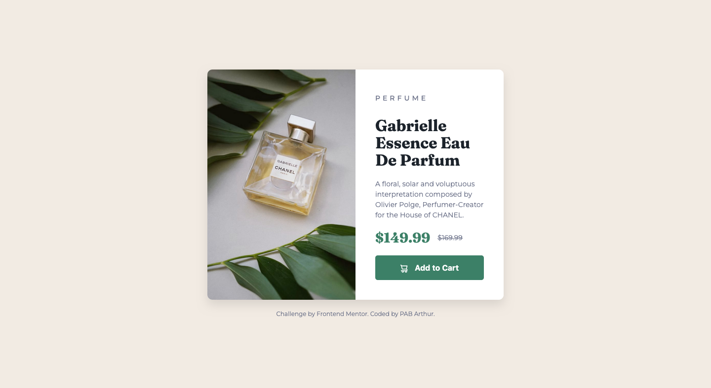

# Frontend Mentor - Product preview card component solution

This is a solution to the [Product preview card component challenge on Frontend Mentor](https://www.frontendmentor.io/challenges/product-preview-card-component-GO7UmttRfa). Frontend Mentor challenges help you improve your coding skills by building realistic projects.

## Table of contents

- [Overview](#overview)
  - [The challenge](#the-challenge)
  - [Screenshot](#screenshot)
  - [Links](#links)
- [My process](#my-process)
  - [Built with](#built-with)
  - [What I learned](#what-i-learned)
  - [Continued development](#continued-development)
- [Author](#author)
- [Acknowledgments](#acknowledgments)

## Overview

### The challenge

Users should be able to:

- View the optimal layout depending on their device's screen size
- See hover and focus states for interactive elements

### Screenshot



### Links

- Solution URL: [Add solution URL here](https://your-solution-url.com)
- Live Site URL: [Add live site URL here](https://your-live-site-url.com)

## My process

### Built with

- Semantic HTML5 markup
- CSS custom properties
- Flexbox
- Mobile-first workflow

### What I learned

During this challenge, I improved my skills in creating responsive layouts using Flexbox. I learned how to effectively use media queries to adjust the layout for different screen sizes. Additionally, I practiced implementing hover and focus states to enhance user interaction.

One specific technique I learned was how to change the image source based on the screen size using CSS. Here is the code snippet I used to achieve that:

```css
.image-section img {
  height: 100%;
  object-fit: cover;
  content: url('../images/image-product-desktop.jpg');
}
```

### Continued development

I want to continue improving my skills in responsive design and CSS techniques. I plan to explore more about CSS Grid and advanced Flexbox layouts to create more complex designs. Additionally, I aim to enhance my understanding of accessibility best practices to ensure my projects are usable by everyone.

## Author

- Frontend Mentor - [@pabjunior](https://www.frontendmentor.io/profile/pabjunior)
- Twitter - [@PAB_junior](https://x.com/PAB_junior)

## Acknowledgments

I would like to thank the Frontend Mentor community for providing such great challenges that help developers improve their skills. Special thanks to anyone who provided feedback on my solution!
